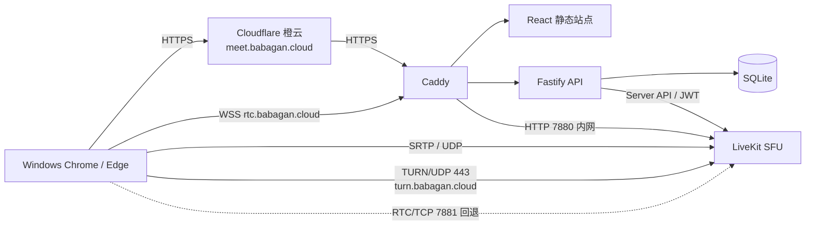
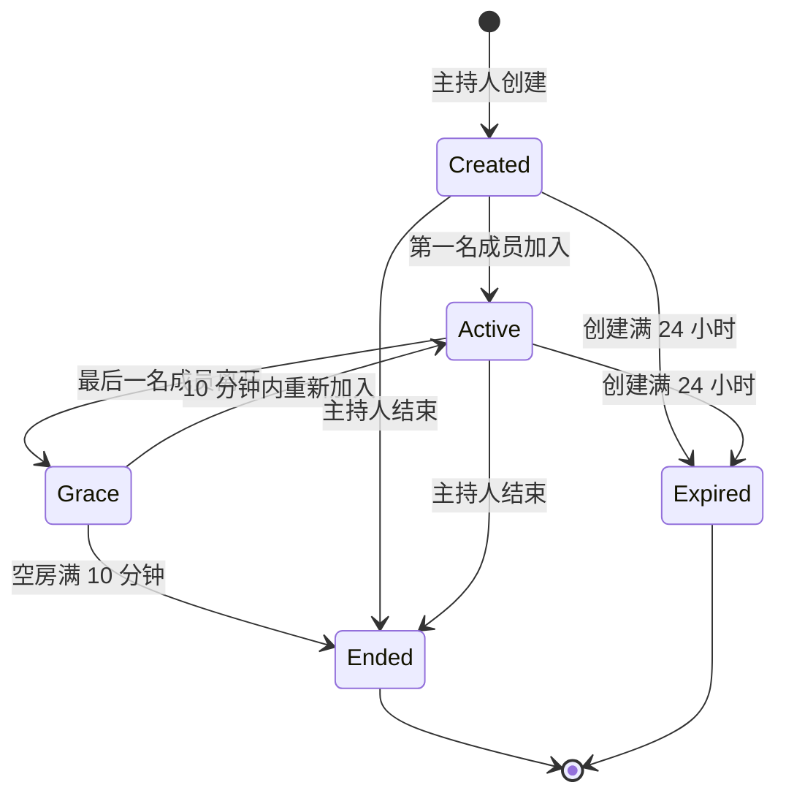

# 技术架构

## 1. 架构概览

控制面和媒体面严格分离：网页、业务 API 和权限属于控制面；LiveKit 的 WebRTC 连接属于媒体面。Node.js 不转发媒体，Cloudflare 普通代理也不承载 UDP 媒体。

## 2. 组件职责

### 2.1 React Web

- 创建会议、入会准备和会议室三个界面。
- 浏览器与设备能力检测。
- 调用 API 获取会议状态和 LiveKit Token。
- 使用 LiveKit Web SDK 发布麦克风、屏幕和屏幕音频轨道。
- 显示连接质量、共享状态、权限和可恢复错误。

Web 不包含业务密钥，不自行判断主持人权限，不把会议密码写入 URL、本地存储或日志。

### 2.2 Fastify API

- 校验服务器级主持人管理密码。
- 创建和恢复主持人会话。
- 执行单活动会议与 5 人上限约束。
- 校验会议密码并生成不可预测的参与者身份。
- 签发最小权限 LiveKit Token。
- 更新成员共享权限、移除成员和结束会议。
- 执行过期与空房清理任务。

### 2.3 SQLite

保存会议、主持人会话和有限审计事件。参与者在线状态、媒体轨道和连接质量由 LiveKit 管理，不复制到数据库。

### 2.4 LiveKit

- SFU 转发 Opus 音频与屏幕视频/音频轨道。
- 管理房间、参与者、订阅、连接质量和重连。
- 优先使用直接 UDP；提供 TURN/UDP 443 和 RTC/TCP 7881 回退。
- 不启用 Egress、Ingress、录制、转码、Agent 或 SIP 服务。

### 2.5 Caddy

- 为 `meet.babagan.cloud` 和 `rtc.babagan.cloud` 终止 TLS。
- 将 `/api/*` 转发至 Fastify，其余 `meet` 请求提供静态网页。
- 将 `rtc` 的 HTTPS/WSS 请求转发至 LiveKit 7880。
- 自动申请和续期公众信任证书。

## 3. 网络与 DNS

| 名称/端口 | 协议 | 路径 | 用途 |
|---|---|---|---|
| `meet.babagan.cloud:443` | HTTPS/WSS | Cloudflare → Caddy | 网页与 API |
| `rtc.babagan.cloud:443` | HTTPS/WSS | 客户端 → Caddy → LiveKit | LiveKit 信令 |
| `turn.babagan.cloud:443` | TURN/UDP | 客户端 → LiveKit | UDP 中继 |
| 公网 IP `50000–60000` | WebRTC UDP | 客户端 → LiveKit | 直接媒体 |
| 公网 IP `7881` | WebRTC TCP | 客户端 → LiveKit | UDP 不可用时回退 |
| 公网 IP `80` | HTTP | ACME/Caddy | 证书验证与 HTTPS 跳转 |

Caddy 不启用占用 UDP 443 的 HTTP/3 监听，避免与 TURN/UDP 443 冲突。服务器内部的 API、SQLite 和 LiveKit 7880 只在 Docker 网络或回环地址开放。

## 4. 关键数据流

### 4.1 加入

1. Web 获取公开会议摘要。
2. 用户提交昵称和会议密码。
3. API 在事务/互斥区中确认会议有效且人数未满。
4. API 生成唯一参与者身份和最小权限 Token。
5. Web 使用 `wss://rtc.babagan.cloud` 连接 LiveKit。
6. LiveKit 建立 ICE/DTLS/SRTP 媒体连接。

### 4.2 麦克风

Token 允许所有成员发布 `microphone`，禁止 `camera` 和数据轨道。Web 首次连接不发布音频；用户点击开麦后才创建并发布麦克风轨道。

### 4.3 屏幕共享

1. 主持人通过 API 授权目标成员。
2. API 更新 LiveKit 参与者权限，只增加 `screen_share` 和 `screen_share_audio` 来源。
3. 客户端调用浏览器屏幕捕获接口，要求用户主动选择来源。
4. 如果浏览器没有返回屏幕音频轨道，UI 明确提示重新选择“整个屏幕/标签页并共享音频”。
5. 停止、断线或撤销时，API/LiveKit 释放共享锁。

## 5. 状态模型

`Ended` 和 `Expired` 均为终态，不能再次签发 Token。服务重启时按数据库时间戳恢复并立即清理已经超时的状态。

## 6. 容量与资源预算

单路 1080p30 预估发布码率 4–8 Mbps，向 4 名观看者转发约 16–32 Mbps；1080p60 预估发布码率 8–15 Mbps，转发约 32–60 Mbps。加上语音和协议开销，仍低于 200 Mbps 峰值，但峰值带宽不属于严格 SLA。

内存预算：LiveKit 900–1200 MiB、Node/Web 200–350 MiB、Caddy 50–100 MiB、系统及页缓存保留 400 MiB 左右。超过 1.8 GiB 或发生交换应告警。

## 7. 架构决策记录

| 决策 | 选择 | 原因 |
|---|---|---|
| 媒体拓扑 | SFU | 避免共享者向 4 人重复上传 |
| 媒体平台 | LiveKit | 屏幕音频、权限、重连与 TURN 成熟 |
| 数据库 | SQLite | 单实例、低写入量，无需额外常驻服务 |
| 部署 | Docker Compose | 可重复部署、隔离和快速回滚 |
| TURN | UDP 443 | 与 Caddy TCP 443 不冲突，适合现有单公网 IP |
| Cloudflare | Web 橙云、媒体灰云 | Web 获得 TLS/WAF，UDP 保持直连 |
| 视频策略 | 无服务端转码 | 保护 2 核 CPU，使用浏览器编码和自适应发送 |

## 8. 已知限制

- 极严格的企业网络可能同时阻止 UDP 443 和 TCP 7881。此类环境需要额外的 TURN/TLS 443 架构、第二公网 IP 或商业中继服务。
- Cloudflare 免费通用证书只覆盖根域名和一级子域名，本系统仅使用一级子域名。
- 系统声音捕获由 Windows 与 Chrome/Edge 决定，网页不能绕过用户授权或浏览器限制。

## 9. 官方参考

- [LiveKit 自托管部署](https://docs.livekit.io/transport/self-hosting/deployment/)
- [LiveKit 屏幕与浏览器音频共享](https://docs.livekit.io/transport/media/screenshare/)
- [MDN getDisplayMedia](https://developer.mozilla.org/en-US/docs/Web/API/MediaDevices/getDisplayMedia)
- [Cloudflare DNS 代理状态](https://developers.cloudflare.com/dns/proxy-status/)
- [Cloudflare 代理协议限制](https://developers.cloudflare.com/dns/proxy-status/limitations/)
- [Cloudflare Full (strict) SSL/TLS](https://developers.cloudflare.com/ssl/get-started/)
