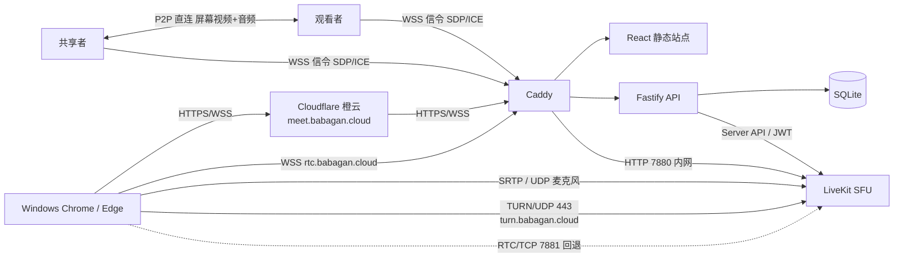
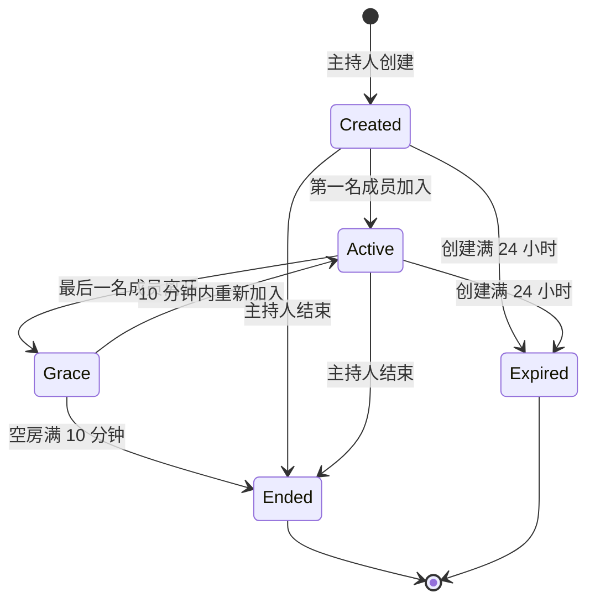

# 技术架构

## 1. 架构概览

控制面和媒体面严格分离：网页、业务 API 和权限属于控制面；LiveKit 的 WebRTC 连接属于媒体面。Node.js 不转发媒体，Cloudflare 普通代理也不承载 UDP 媒体。

**媒体拓扑（2026-08-11 变更，详见 `07-p2p-screen-share-design.md`）**：

- **麦克风音频**：全部经 LiveKit SFU 转发（5 人全部音频经云端仅约 1 Mbps，保持现状）。
- **屏幕共享（视频 + 音频）**：优先走浏览器间 **P2P 直连**（共享者 → 观看者，1:N 星型），云端只承担 SDP/ICE 信令（每连接数 KB）；直连失败自动回退 LiveKit SFU 屏幕订阅，体验不劣于现状。云端不承载 P2P 屏幕媒体，解决云带宽波动导致接收画面不稳定的问题。

## 2. 组件职责

### 2.1 React Web

- 创建会议、入会准备和会议室三个界面。
- 浏览器与设备能力检测。
- 调用 API 获取会议状态和 LiveKit Token。
- 使用 LiveKit Web SDK 发布麦克风；屏幕共享优先使用 P2P 通道（新增），失败回退发布 LiveKit 屏幕轨道。
- P2P 信令客户端：连接 `wss://meet.babagan.cloud/api/v1/meetings/:slug/p2p`，交换 SDP/ICE 候选。
- P2P 会话控制器：为每名观看者维护独立 `RTCPeerConnection` 会话与回退状态机（见 `07` 设计 §5）。
- 显示连接质量、共享状态、权限和可恢复错误。

Web 不包含业务密钥，不自行判断主持人权限，不把会议密码写入 URL、本地存储或日志。

### 2.2 Fastify API

- 校验服务器级主持人管理密码。
- 创建和恢复主持人会话。
- 执行单活动会议与 5 人上限约束。
- 校验会议密码并生成不可预测的参与者身份。
- 签发最小权限 LiveKit Token。
- 更新成员共享权限、移除成员和结束会议。
- 执行过期与空房清理任务。
- **P2P 信令端点（新增）**：`/api/v1/meetings/:slug/p2p` WebSocket，校验参与者 Cookie 与同源 Origin，维护房间在线名单，转发 SDP/ICE/`media-ready` 消息，强制"仅共享者发 offer"等权限规则（见 `07` 设计 §4）。
- **ICE 配置端点（新增）**：`GET /api/v1/meetings/:slug/ice-servers`，经参与者会话鉴权后返回启动时校验的 `P2P_STUN_URLS` 与 `P2P_TURN_URLS`（后者附带参与者绑定的短期 TURN REST HMAC 凭据）。

### 2.3 SQLite

保存会议、主持人会话和有限审计事件。参与者在线状态、媒体轨道和连接质量由 LiveKit 管理，不复制到数据库。P2P 信令会话为内存态，不落库。

### 2.4 LiveKit

- SFU 转发 Opus 麦克风音频；共享开始时先发布屏幕安全网并保持到共享结束，现代观看者可在 P2P 首帧后取消自己的屏幕订阅。
- 管理房间、参与者、订阅、连接质量和重连。
- 优先使用直接 UDP；提供 TURN/UDP 443 和 RTC/TCP 7881 回退，服务自身媒体（语音与回退屏幕）。
- 不启用 Egress、Ingress、录制、转码、Agent 或 SIP 服务。

### 2.5 Caddy

- 为 `meet.babagan.cloud` 和 `rtc.babagan.cloud` 终止 TLS。
- 将 `/api/*`、`/health/*` 转发至 Fastify，`/rtc*` 转发至 LiveKit 7880，其余 `meet` 请求转发至 `web` 容器（Caddy :8080 提供静态产物）。
- 将 `rtc` 的 HTTPS/WSS 请求转发至 LiveKit 7880。
- 为 `turn.babagan.cloud` 申请公众信任证书并把证书卷只读提供给 coturn。
- 自动申请和续期公众信任证书。

### 2.6 TURN provider（P2P TURN 中继）

- 默认保留独立 coturn，为 P2P 屏幕共享提供 relay 候选，供直连失败的观看者仍经 P2P 通道收发屏幕媒体。
- 可将 API 的 `P2P_TURN_PROVIDER` 切换为 `cloudflare`：API 服务端使用受保护的 Cloudflare TURN Key ID 与创建 app 时一次性返回的 TURN Key API Token/Secret 生成短期凭据；Cloudflare 凭据获取失败时回退 coturn。
- 监听 3478/UDP+TCP、5349/TLS，中继端口池 49160–49200/UDP；禁用 DTLS、管理 CLI，并拒绝 loopback/RFC1918/链路本地/组播对端。
- coturn 使用 TURN REST 鉴权（`use-auth-secret`），共享密钥与 API 的 `P2P_TURN_SECRET` 一致；API 为已认证参与者签发 600 秒短期凭据。Cloudflare provider 使用 Cloudflare API 生成短期凭据，长期 Token 不下发浏览器。

## 3. 网络与 DNS

| 名称/端口 | 协议 | 路径 | 用途 |
|---|---|---|---|
| `meet.babagan.cloud:443` | HTTPS/WSS | Cloudflare → Caddy | 网页、API 与 P2P 信令（`/api/*` 反代覆盖 WSS 升级） |
| `rtc.babagan.cloud:443` | HTTPS/WSS | 客户端 → Caddy → LiveKit | LiveKit 信令 |
| `turn.babagan.cloud:443` | TURN/UDP | 客户端 → LiveKit | LiveKit 内置 TURN，服务语音与回退屏幕的媒体路径 |
| `turn.babagan.cloud:3478` | TURN/UDP+TCP | 客户端 → coturn | P2P 屏幕共享的 TURN 中继（relay 候选） |
| `turn.babagan.cloud:5349` | TURN/TLS（TCP） | 客户端 → coturn | P2P TURN 的 TLS 入口 |
| `turn.babagan.cloud:49160–49200` | TURN relay UDP | 客户端 → coturn | P2P 屏幕中继端口池 |
| 公网 IP `50000–60000` | WebRTC UDP | 客户端 → LiveKit | 直接媒体（麦克风；回退时的屏幕） |
| 公网 IP `7881` | WebRTC TCP | 客户端 → LiveKit | UDP 不可用时回退 |
| 公网 IP `80` | HTTP | ACME/Caddy | 证书验证与 HTTPS 跳转 |

P2P 屏幕共享的信令复用 `meet` 的 WSS 路径；ICE 使用 `P2P_STUN_URLS` 与当前 TURN provider 的短期凭据。成功直连（host/srflx）的媒体在共享者与观看者之间流动；无法直连时优先经当前 TURN relay 中继（仍是 P2P 通道），该观看者仍失败才继续使用始终发布的 LiveKit 屏幕安全网。页面会显示实际使用的 TURN provider。

Caddy 不启用占用 UDP 443 的 HTTP/3 监听，避免与 TURN/UDP 443 冲突。服务器内部的 API、SQLite 和 LiveKit 7880 只在 Docker 网络或回环地址开放。

## 4. 关键数据流

### 4.1 加入

1. Web 获取公开会议摘要。
2. 用户提交昵称和会议密码。
3. API 在事务/互斥区中确认会议有效且人数未满。
4. API 生成唯一参与者身份和最小权限 Token。
5. Web 使用 `wss://rtc.babagan.cloud` 连接 LiveKit。
6. LiveKit 建立 ICE/DTLS/SRTP 媒体连接（麦克风路径）。
7. Web 打开 P2P 信令 WS（`meet` 域），获得房间成员名单与进退通知，为屏幕共享 P2P 协商做准备。

### 4.2 麦克风

Token 允许所有成员发布 `microphone`，禁止 `camera` 和数据轨道。Web 首次连接不发布音频；用户点击开麦后才创建并发布麦克风轨道。

### 4.3 屏幕共享（P2P 优先，回退 SFU）

1. 主持人通过 API 授权目标成员（共享锁，语义不变）。
2. API 更新 LiveKit 参与者权限，只增加 `screen_share` 和 `screen_share_audio` 来源。
3. 共享者客户端调用浏览器屏幕捕获接口，要求用户主动选择来源；屏幕音频轨道必须保留（P2P 音画同步硬约束）。
4. 共享者先发布 LiveKit 屏幕安全网，再通过 P2P 信令向每名 P2P 在线观看者发起协商，并在同一条 `RTCPeerConnection` 发送屏幕视频与音频。
5. 观看者验证直连候选对、RTP 增长和视频解码，渲染 P2P 首帧后才取消自己的 LiveKit 屏幕订阅；8 秒未收到媒体、ICE 失败或 5 秒无 RTP 进展时先恢复 LiveKit 订阅，首帧后关闭 P2P。
6. 共享停止、断线或撤销时，关闭全部 P2P 连接与 LiveKit 屏幕轨道，API/LiveKit 释放共享锁。

## 5. 状态模型

`Ended` 和 `Expired` 均为终态，不能再次签发 Token。服务重启时按数据库时间戳恢复并立即清理已经超时的状态。

## 6. 容量与资源预算

**2026-08-11 起（P2P 混合模式）**：

- **现代观看者成功切到 P2P 后不再从云端接收屏幕**：共享者上行承担直连流量；LiveKit 屏幕发布仍常驻，但只有旧客户端、协商中或回退观看者保持订阅。实际节省取决于直连成功率和观看者网络，不能用单台设备的 100 Mbps 测量外推全部共享者。
- P2P 信令为控制面消息（SDP/ICE），每连接数 KB，对 API 进程可忽略。
- 云端带宽告警阈值相应下调（见 `04` 文档 §9 变更）。

内存预算：LiveKit 900–1200 MiB、Node/Web 200–350 MiB、Caddy 50–100 MiB、系统及页缓存保留 400 MiB 左右。超过 1.8 GiB 或发生交换应告警。P2P 信令在线名单与转发缓冲在内存中，规模恒为单会议 ≤5 人，无额外内存压力。

## 7. 架构决策记录

| 决策 | 选择 | 原因 |
|---|---|---|
| 媒体拓扑（音频） | SFU | 5 人音频经云端仅约 1 Mbps，保留 LiveKit 成熟能力 |
| 媒体拓扑（屏幕，2026-08-11 变更） | **P2P 直连 + coturn TURN 中继 + 常驻 SFU 安全网** | 直连（host/srflx）成功者绕开云端带宽；relay 候选经 coturn 中继；旧客户端与最终失败者始终可使用 LiveKit。共享者实际可用上行决定可行档位 |
| 媒体平台 | LiveKit | 屏幕音频、权限、重连与兼容兜底成熟；P2P STUN 独立由 API 配置 |
| 数据库 | SQLite | 单实例、低写入量，无需额外常驻服务 |
| 部署 | Docker Compose | 可重复部署、隔离和快速回滚 |
| TURN | LiveKit 内置 UDP 443 + 独立 coturn 3478/5349 | LiveKit 的 TURN/UDP 443 服务语音与回退屏幕；coturn 为 P2P 屏幕共享提供可带短期凭据的 TURN 中继 |
| Cloudflare | Web 橙云、媒体灰云 | Web 获得 TLS/WAF，UDP 保持直连 |
| 视频策略 | 无服务端转码 | 保护 2 核 CPU，使用浏览器编码和自适应发送 |
| P2P 信令 | Fastify WebSocket（`/api/*` 反代） | 信令不新增域名；参与者 Cookie + 同源 Origin 鉴权；服务器不接触媒体内容 |

## 8. 已知限制

- 极严格的企业网络可能同时阻止 UDP 443 和 TCP 7881。此类环境需要额外的 TURN/TLS 443 架构、第二公网 IP 或商业中继服务。
- Cloudflare 免费通用证书只覆盖根域名和一级子域名，本系统仅使用一级子域名。
- 系统声音捕获由 Windows 与 Chrome/Edge 决定，网页不能绕过用户授权或浏览器限制。
- P2P 直连依赖双方 NAT 可穿透：CGNAT 且无 IPv6 的观看者只能回退 SFU/TURN（该观看者体验不劣于现状，但不享受直连收益）。
- 客户端代理/TUN 软件（如 Mihomo、Clash TUN 模式）会劫持 WebRTC UDP 媒体，需配置直连规则或临时关闭（共享者与观看者均受影响，见 `07` 设计 §6.4）。
- 共享者家庭 IP 随拨号变化：不影响已建立的连接，只影响下次会议协商（不依赖 DDNS）。
- P2P 直连时屏幕内容不经过云端服务器；对端之间将看到彼此直连 IP，属 WebRTC 直连固有特征。

## 9. 官方参考

- [LiveKit 自托管部署](https://docs.livekit.io/transport/self-hosting/deployment/)
- [LiveKit 屏幕与浏览器音频共享](https://docs.livekit.io/transport/media/screenshare/)
- [MDN getDisplayMedia](https://developer.mozilla.org/en-US/docs/Web/API/MediaDevices/getDisplayMedia)
- [Cloudflare DNS 代理状态](https://developers.cloudflare.com/dns/proxy-status/)
- [Cloudflare 代理协议限制](https://developers.cloudflare.com/dns/proxy-status/limitations/)
- [Cloudflare Full (strict) SSL/TLS](https://developers.cloudflare.com/ssl/get-started/)
