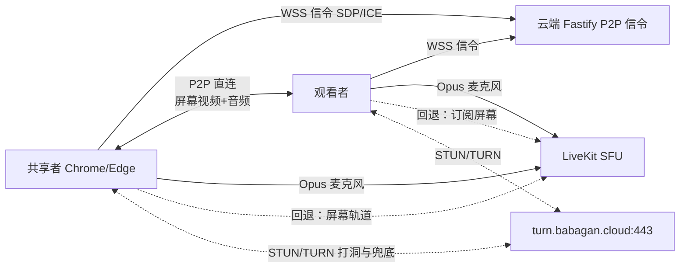

# P2P 屏幕共享混合模式设计

日期：2026-08-11
状态：已确认（替代 2026-08-07 设计中的"媒体全部经 LiveKit SFU 转发"决策）

## 1. 背景与动机

现行架构（见 `02-technical-architecture.md`）中，屏幕共享经 LiveKit SFU 云端转发：
共享者 → 家庭上行 → **云端服务器**（阿里云武汉，200 Mbps 峰值带宽，无 SLA）→ 接收者下行。

生产观测到的核心问题：**云端服务器带宽波动导致接收方画面不稳定**。200 Mbps 为峰值共享带宽，高峰期受邻居争抢；2 核 CPU 转发多路 1080p60 高码率时也可能成为瓶颈。单路 1080p 屏幕 4–8 Mbps（上限档 15 Mbps），4 名观看者意味着 16–60 Mbps 流量全部依赖这条不稳定链路。

共享者本机网络经实测具备直连条件：

| 项目 | 实测结果 |
|---|---|
| 本地链路 | Realtek 2.5GbE 有线，协商 1 Gbps |
| 公网 IPv4 | 117.151.175.232（中国移动·湖北荆州），非 CGNAT 段（100.64/10），家庭路由器 NAT |
| IPv6 | 本机无全局 IPv6 地址（路由器未下发），不依赖 IPv6 路径 |
| 上行带宽 | 约 100 Mbps 稳定 |

**结论**：共享者上行充裕且稳定，唯一的不可控环节是云端转发。将屏幕媒体改为浏览器间 P2P 直连，可把云端从屏幕媒体路径中完整移除，接收方画面只依赖"共享者上行 → 互联网 → 接收者下行"这条链路。

## 2. 方案概述（混合模式）

| 媒体 | 路径 | 理由 |
|---|---|---|
| 麦克风音频 | 保持 LiveKit SFU | 5 人全部音频经云端仅约 1 Mbps；保留 LiveKit 成熟的重连、权限、质量统计能力 |
| **屏幕视频 + 屏幕音频** | **P2P 直连（RTCPeerConnection）**，失败自动回退 LiveKit SFU | 屏幕是带宽大头（16–60 Mbps），直连后云端占用归零 |
| 信令 | 云端 Fastify 新增 WebSocket 信令端点 | SDP/ICE 交换，每连接仅数 KB |
| 兜底 | TURN/UDP 443（现有 LiveKit TURN 服务，凭据经 LiveKit Server API 获取） | 直连失败者回退，不劣于现状 |



## 3. 设计原则

1. **直连优先，兜底保底**：WebRTC ICE 候选优先级 host > srflx > relay 天然优先直连；直连失败自动回退，**任何观看者的体验不劣于现状**。
2. **单一发布者**：屏幕只由共享者发布，观看者只收不发，沿用现有共享锁语义。
3. **双源不并存**：同一观看者在"P2P 源"与"LiveKit 源"之间切换，不并行接收，避免带宽翻倍。
4. **音画同步硬约束**：屏幕音频轨道必须与屏幕视频轨道发布在同一条 `RTCPeerConnection` 上（见 §8）。
5. **服务器不感知媒体**：P2P 信令端点只做鉴权、在线名单和 SDP/ICE 转发，不接触媒体内容。

## 4. P2P 信令协议

### 4.1 端点与传输

- 端点：`wss://meet.babagan.cloud/api/v1/meetings/:slug/p2p`
- 复用现有 Caddy `/api/*` 反向代理与 Cloudflare 橙云 WSS 升级，不新增域名与端口
- 认证：WebSocket 握手时校验参与者安全 Cookie（现有 `__Host-` 参与者会话），服务端将连接映射到 `participantIdentity`；无有效 Cookie 拒绝握手
- 服务端只做**鉴权 + 转发 + 在线名单**，不存储 SDP 与 ICE 候选（日志禁用 SDP 全文）

### 4.2 消息类型

客户端与客户端之间的消息由服务端转发，均携带 `to`（目标身份）。全部消息为 JSON，大小上限 64 KiB。

| 消息 | 方向 | 字段 | 作用 |
|---|---|---|---|
| `hello` | 客户端 → 服务端 | `participantIdentity` | 连接建立后声明身份（服务端已从 Cookie 验证，用于一致性校验） |
| `welcome` | 服务端 → 客户端 | `peers: [{identity, nickname}]` | 房间内当前成员名单 |
| `peer-joined` | 服务端 → 客户端 | `peer: {identity, nickname}` | 成员加入通知 |
| `peer-left` | 服务端 → 客户端 | `peer: {identity}` | 成员离开通知 |
| `offer` | 共享者 → 观看者 | `to, sdp` | 发起 P2P 协商（仅共享者有权发送） |
| `answer` | 观看者 → 共享者 | `to, sdp` | 应答协商（仅能回给共享者） |
| `ice` | 双方 | `to, candidate` | Trickle ICE 候选，逐条转发 |
| `bye` | 双方 | `to, reason` | 主动关闭与对端的 P2P 连接 |
| `ping` / `pong` | 客户端 → 服务端 | — | 应用层心跳（25 秒间隔，30 秒无响应视为失联） |
| `error` | 服务端 → 客户端 | `code, message` | 协议或权限错误 |

### 4.3 服务端强制规则

- 只有当前 `share_identity`（共享锁持有者）可以向他人发送 `offer`
- 观看者只能向当前共享者发送 `answer` 和 `ice`
- 消息目标必须是同一会议中当前在线的成员；非法目标直接丢弃并返回 `error`
- 共享锁释放（撤销/结束/共享者离开）时，服务端向全员广播 `peer-left` 语义的 `share-gone` 通知（复用 `bye` + 原因字段），客户端据此清理 P2P 连接
- 速率限制：每连接消息速率受限，SDP 总量受限，防止被用作反射放大

### 4.4 加入与退出时序

1. 观看者加入会议（现有 POST `/join` 流程）成功后，打开 P2P 信令 WS
2. 服务端 `welcome` 返回当前成员名单；后续成员进退通过 `peer-joined` / `peer-left` 增量同步
3. 共享者被授权后，由客户端向各在线观看者发起 `offer`（见 §5）
4. 共享者停止或撤销时，关闭所有 P2P 连接并发送 `bye`；观看者清理远端流

## 5. 媒体拓扑与会话模型

### 5.1 星型拓扑

共享者对**每名观看者各建一条** `RTCPeerConnection`（1:N 星型）：

- 每条连接发布两条轨道：`screen video` + `screen audio`（同一条连接，保证音画同步）
- 观看者之间不建连；观看者不向共享者发布任何轨道
- 共享者上行 = 观看人数 × 单路码率（例：4 人 × 8 Mbps = 32 Mbps，100 Mbps 上行充裕）

### 5.2 观看者级会话状态

共享者端为每名观看者维护独立会话状态，互不影响：

```
idle → p2p-negotiating → p2p-active → closed
                 │
                 └── 8 秒超时 / ICE failed / RTP 失联 → livekit-fallback
```

| 状态 | 说明 |
|---|---|
| `p2p-negotiating` | 已发送 offer，等待 answer 与 ICE 收敛；超时 8 秒 |
| `p2p-active` | ICE 状态 `connected` 且已开始收到 RTP |
| `livekit-fallback` | 该观看者改用 LiveKit 屏幕轨道（现有 SFU 路径） |
| `closed` | 共享停止、对端离开或撤销 |

观看者端对称维护：`idle → p2p-negotiating → p2p-active → closed`，失败时通知共享者回退。

### 5.3 回退状态机（共享者发布侧）

P2P 回退与 LiveKit 屏幕发布以**需求驱动**：只有至少一名观看者处于 `livekit-fallback` 时才通过 LiveKit 发布屏幕轨道；全部观看者 `p2p-active` 时 LiveKit 不发布屏幕（节省云端带宽）。

```
共享开始
  ├─ 向每名观看者发起 P2P 协商
  ├─ 部分观看者 P2P 成功 → 这些人走 P2P
  ├─ 部分观看者 P2P 失败 → 共享者发布 LiveKit 屏幕轨道（若无），失败者订阅
  └─ 全部失败 → 完全走 LiveKit（等价于现行架构，体验不劣于现状）
```

共享过程中：

- 某观看者 P2P 断线（ICE `disconnected` 持续 5 秒或 `failed`）→ 该观看者切换 LiveKit 源
- 共享者断网重连 → 按现有 LiveKit 重连逻辑恢复身份与订阅，P2P 会话重新协商或整体回退
- 主持人撤销 / 共享者主动停止 → 关闭全部 PC 与 LiveKit 屏幕轨道，观看者清理

## 6. ICE 与网络策略

### 6.1 ICE 服务器配置

- **凭据来源**：API 新增 `GET /api/v1/meetings/:slug/ice-servers`（参与者 Cookie 鉴权），服务端调用 LiveKit Server API 的 ICE 端点（`POST /rtc/ice`）获取 STUN 与 TURN 凭据返回给客户端；凭据在服务端缓存（TTL 1 小时），TURN 复用现有 `turn.babagan.cloud:443`，不新增端口
- 客户端将返回的 `iceServers` 用于 P2P `RTCPeerConnection` 配置
- 候选优先级由浏览器 ICE 处理：host（局域网/本机）> srflx（STUN 公网映射）> relay（TURN）

### 6.2 直连成功条件（共享者）

| 条件 | 说明 |
|---|---|
| 公网 IPv4（或 IPv6） | 实测具备（117.151.175.232） |
| 家庭路由器 NAT | 家用路由器一般支持打洞（full-cone），满足 srflx 直连 |
| UDP 出网不被代理拦截 | 见 §6.4 注意事项 |
| 稳定上行 | 100 Mbps 实测；最低建议 ≥30 Mbps 且 ≥ 观看人数 × 8 Mbps |

观看者只需能出 UDP 且 NAT 可穿透；无需公网 IP。**CGNAT 观看者（无 IPv6）直连失败时自动回退，体验不劣于现状。**

### 6.3 动态 IP

家庭 IP 随拨号变化。已建立的 P2P 连接点对点维持，不受影响；IP 变化只影响下次开会（新协商走新候选）。不在本次范围做 DDNS。

### 6.4 客户端网络注意事项（重要）

1. **代理/TUN 软件（如 Mihomo、Clash TUN 模式）会劫持 WebRTC UDP 流量**：实测默认路由被 TUN 接管时出网绕道海外代理节点。开会前需确保媒体流直连：为会议媒体配置直连规则，或临时关闭 TUN/代理。文档与 UI 提示需注明。
2. 公司/校园网络可能禁止 UDP：自动回退到 LiveKit（其内部已有 RTC/TCP 7881 与 TURN 回退），不影响语音。
3. 2.4 GHz Wi-Fi 干扰大的场景建议改用有线。

## 7. 码率与质量策略

### 7.1 档位定义

| 模式 | 档位（Mbps） | 默认 | 适用 |
|---|---|---|---|
| SFU 回退（不变） | 10 / 13 / 15 | 10 | 与现状一致，不动现有逻辑 |
| **P2P 直连（新增）** | **5 / 8 / 10** | **8** | 上限受共享者上行约束：N 人 × 档位 < 可用上行 |

### 7.2 档位联动建议

共享开始时按**当前在线观看者数**给出建议档位并默认选中（可手动调整）：

| 观看者数 | 建议默认档位 | 共享者上行占用 |
|---|---|---|
| 1–2 | 8 Mbps | 8–16 Mbps |
| 3 | 8 Mbps | 24 Mbps |
| 4 | 5 Mbps | 20 Mbps |

### 7.3 自适应

- 每条 P2P 连接独立启用浏览器拥塞控制（Transport-CC + REMB），观看者弱网时仅该路自动降码率，**不拖累其他观看者**（相对 SFU 模式全体共享带宽池是结构性改进）
- 编码保持 `degradationPreference: maintain-resolution`（保分辨率、降帧率），文字可读性优先
- 音画同步约束见 §8；语音优先级不变（P2P 码率上限始终受档位约束，语音走独立路径不受挤压）

## 8. 音画同步

**硬约束：屏幕音频轨道与屏幕视频轨道必须发布在同一条 `RTCPeerConnection` 上。**

- WebRTC 在同一连接内通过 RTCP Sender Report 的 NTP 时间戳做音画对齐，这是浏览器原生能力，可靠（误差毫秒级）
- 若屏幕音频单独走 LiveKit（另一条连接），两条连接没有共享时间轴，无法自动同步，会出现数百毫秒级音画错位——**因此禁止此组合**
- 麦克风语音（LiveKit 路径）与屏幕画面（P2P 路径）允许 ≤300 ms 相对偏移，不承诺严格同步；会议场景下（说话声与屏幕内容非同一信号源）可接受，与主流视频会议产品行为一致
- 回退到 LiveKit 时，音画同步由 LiveKit 保证（同房间同发布者，同一条 RTP 会话）

## 9. 权限与安全

- 信令端点继承参与者会话鉴权（Cookie），且服务端强制"仅共享者发 offer、仅能发给共享者应答"规则（§4.3），普通成员无法诱骗他人建立 P2P 连接
- 媒体安全沿用 DTLS-SRTP（浏览器原生），信令经 WSS（TLS 1.2+）
- **隐私变化**：P2P 直连后屏幕内容不再经过云端服务器（服务器对媒体零可见性，强于 SFU 模式）；对端将看到彼此的直连 IP（WebRTC 直连的固有特征），与视频会议产品一致，文档与 UI 说明
- 不引入新的业务密钥；SDP 与 ICE 候选不落日志（沿用 `06-security-and-privacy.md` §7 规则）
- 服务端转发消息限速、限大小（64 KiB），防止信令放大

## 10. 监控与质量指标

| 指标 | 采集位置 | 用途 |
|---|---|---|
| P2P 建立成功率、平均建立时长 | 前端统计，会议结束后聚合上报（不含媒体） | 直连穿透率评估 |
| 回退率（P2P → LiveKit） | 同上 | 兜底依赖度 |
| P2P RTT、丢包、码率、分辨率 | 复用现有 `webrtc-stats` 面板 | 接收端质量诊断 |
| 云端带宽占用 | 服务器监控 | 混合模式收益验证（屏幕共享时不应再出现 16–60 Mbps 突发） |

服务器告警调整：屏幕媒体直连后，云端带宽尖峰预期大幅下降；带宽告警阈值从"持续 >120 Mbps"下调至"持续 >50 Mbps 或出现突发"，同时新增"P2P 回退率异常升高（>50%）"的人工观察项。

## 11. 明确不做

- 摄像头、录制、转码、混流等（与 PRD 一致）
- P2P 麦克风音频（带宽收益小，复杂度高，保留 SFU 的可靠性）
- 移动端屏幕共享、macOS/Firefox/Safari 验收（与 PRD 一致）
- 端到端加密、多房间、家庭 SFU 部署、DDNS
- 服务器记录或分析媒体内容

## 12. 风险与缓解

| 风险 | 缓解 |
|---|---|
| 直连成功率不达标（观看者 CGNAT 且无 IPv6） | 自动回退 LiveKit SFU/TURN，体验不劣于现状；监控回退率持续改进 |
| 共享者家庭网络波动 | 有线优先建议；断线后按现有重连逻辑恢复，P2P 会话重建或整体回退 |
| 客户端代理/TUN 劫持媒体 | §6.4 注意事项 + UI 提示；可配置直连规则 |
| 家庭 IP 变化 | 不影响已建立连接；仅影响下次会议协商 |
| 共享者上行不足（档位过高） | 档位联动建议 + 手动可调 + 拥塞控制自动降码率 |
| 信令服务不可用 | 观看者直接走 LiveKit 屏幕订阅（P2P 只是增强路径），语音不受影响 |

## 13. 实施影响一览

| 层 | 变更 |
|---|---|
| contracts 包 | 新增 P2P 信令消息类型与 JSON Schema |
| API | 新增 WS 信令端点、ICE 凭据端点、相关配置项与速率限制 |
| Web | 新增 P2P 信令客户端、P2P 会话控制器（含状态机与回退）、码率档位联动 UI |
| Web（观看端） | 双源渲染（P2P 流 / LiveKit 轨道）切换 |
| 部署 | 无新域名新端口；Caddy `/api` 反代已覆盖 WSS；监控与告警调整 |
| 测试 | 新增 NAT 穿透矩阵、回退、音画同步用例（见 `05` 文档更新） |

详细实现规格见 `03-implementation-specification.md` 更新；分阶段实施计划见 `docs/superpowers/plans/2026-08-11-p2p-hybrid-implementation.md`。
