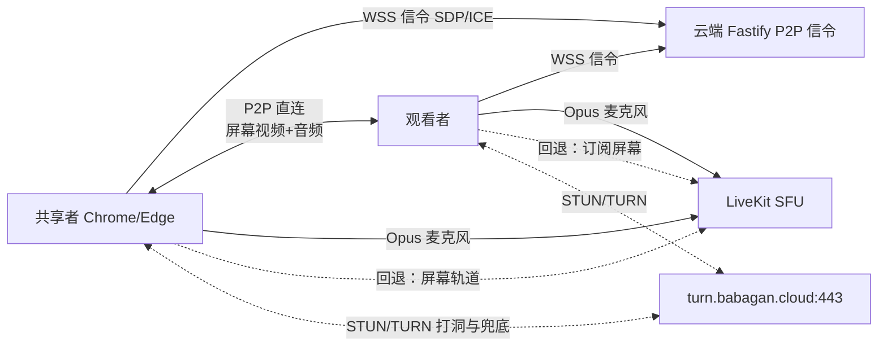

# P2P 屏幕共享混合模式设计

日期：2026-08-11
状态：已确认（替代 2026-08-07 设计中的"媒体全部经 LiveKit SFU 转发"决策）

## 1. 背景与动机

现行架构（见 `02-technical-architecture.md`）中，屏幕共享经 LiveKit SFU 云端转发：
共享者 → 家庭上行 → **云端服务器**（阿里云武汉，200 Mbps 峰值带宽，无 SLA）→ 接收者下行。

生产观测到的核心问题：**云端服务器带宽波动导致接收方画面不稳定**。200 Mbps 为峰值共享带宽，高峰期受邻居争抢；2 核 CPU 转发多路 1080p60 高码率时也可能成为瓶颈。单路 1080p 屏幕 4–8 Mbps（上限档 15 Mbps），4 名观看者意味着 16–60 Mbps 流量全部依赖这条不稳定链路。

共享者本机网络经实测具备直连条件：

| 项目 | 实测结果 |
|---|---|
| 本地链路 | Realtek 2.5GbE 有线，协商 1 Gbps |
| 公网 IPv4 | 家庭公网 IPv4（已脱敏，中国移动·湖北），非 CGNAT 段（100.64/10），家庭路由器 NAT |
| IPv6 | 本机无全局 IPv6 地址（路由器未下发），不依赖 IPv6 路径 |
| 上行带宽 | 一台设备约 100 Mbps 稳定（单点测量，不外推） |

**结论**：该测试设备具备尝试 P2P 的条件，但共享者上行、双方 NAT 和公网路径都可能变化。混合模式让成功直连的现代观看者绕开云端屏幕转发，同时用常驻 LiveKit 发布覆盖旧客户端与失败路径。

## 2. 方案概述（混合模式）

| 媒体 | 路径 | 理由 |
|---|---|---|
| 麦克风音频 | 保持 LiveKit SFU | 5 人全部音频经云端仅约 1 Mbps；保留 LiveKit 成熟的重连、权限、质量统计能力 |
| **屏幕视频 + 屏幕音频** | **P2P 直连（RTCPeerConnection）**，失败自动回退 LiveKit SFU | 屏幕是带宽大头；成功直连并取消 LiveKit 订阅的现代观看者不再消耗对应云端下行 |
| 信令 | 云端 Fastify 新增 WebSocket 信令端点 | SDP/ICE 交换，每连接仅数 KB |
| 兜底 | 始终已发布的 LiveKit SFU 屏幕轨道 | 直连失败者按观看者重新订阅，不劣于旧客户端现状 |



## 3. 设计原则

1. **直连优先，兜底保底**：WebRTC ICE 候选优先级 host > srflx > relay 天然优先直连；直连失败自动回退，**任何观看者的体验不劣于现状**。
2. **单一发布者**：屏幕只由共享者发布，观看者只收不发，沿用现有共享锁语义。
3. **发布常驻、订阅按需**：共享者始终发布 LiveKit 安全网；现代观看者确认 P2P 首帧后取消本地 LiveKit 屏幕订阅。切换期间允许短暂双源以保留旧帧，首帧确认后立即释放旧源，避免长期带宽翻倍。
4. **音画同步硬约束**：屏幕音频轨道必须与屏幕视频轨道发布在同一条 `RTCPeerConnection` 上（见 §8）。
5. **服务器不感知媒体**：P2P 信令端点只做鉴权、在线名单和 SDP/ICE 转发，不接触媒体内容。

## 4. P2P 信令协议

### 4.1 端点与传输

- 端点：`wss://meet.babagan.cloud/api/v1/meetings/:slug/p2p`
- 复用现有 Caddy `/api/*` 反向代理与 Cloudflare 橙云 WSS 升级，不新增域名与端口
- 认证与来源：WebSocket 握手同时校验参与者安全 Cookie（现有 `__Host-` 参与者会话）和与 `PUBLIC_BASE_URL` 完全一致的 `Origin`；缺失、无效或跨站来源拒绝握手
- 服务端只做**鉴权 + 转发 + 在线名单**，不存储 SDP 与 ICE 候选（日志禁用 SDP 全文）

### 4.2 消息类型

客户端与客户端之间的消息由服务端转发，均携带 `to`（目标身份）。全部消息为 JSON，大小上限 64 KiB。

| 消息 | 方向 | 字段 | 作用 |
|---|---|---|---|
| `hello` | 客户端 → 服务端 | `participantIdentity` | 连接建立后声明身份（服务端已从 Cookie 验证，用于一致性校验） |
| `welcome` | 服务端 → 客户端 | `peers: [{identity, nickname}]` | 房间内当前成员名单（每次重连全量下发） |
| `peer-joined` | 服务端 → 客户端 | `peer: {identity, nickname}` | 成员加入通知 |
| `peer-left` | 服务端 → 客户端 | `peer: {identity}` | 成员离开通知 |
| `offer` | 共享者 → 观看者 | `to, sdp, generation?` | 发起 P2P 协商（仅共享者有权发送） |
| `answer` | 观看者 → 共享者 | `to, sdp, generation?` | 应答协商（仅能回给共享者） |
| `ice` | 双方 | `to, candidate, generation?` | Trickle ICE 候选，逐条转发（`candidate` 为 JSON 序列化的 `RTCIceCandidateInit` 或 `null`） |
| `media-ready` | 观看者 → 共享者 | `to, generation?` | 观看者确认传输已连接且视频解码后通知共享者 |
| `retry` | 观看者 → 共享者 | `to` | 观看者请求共享者为其重建会话并重发全新 offer |
| `bye` | 双方 | `to, reason?` | 主动关闭与对端的 P2P 连接 |
| `share-gone` | 服务端 → 全员 | `reason` | 共享锁释放（撤销/结束/共享者离开/被移除）通知，客户端关闭全部 P2P 连接 |
| `ping` / `pong` | 客户端 → 服务端 / 反向 | — | 应用层心跳（客户端 25 秒间隔；服务端 120 秒无任何帧才判失联） |
| `error` | 服务端 → 客户端 | `code, message` | 协议或权限错误 |

转发的 `offer`/`answer`/`ice`/`bye` 由服务端注入 `from` 字段（`{...msg, from}`）。`generation` 字段用于区分同一次会话的重协商，陈旧候选/应答由客户端按 generation 丢弃。

### 4.3 服务端强制规则

- 只有当前 `share_identity`（共享锁持有者）可以向他人发送 `offer`
- 观看者只能向当前共享者发送 `answer`、`ice`、`media-ready` 和 `retry`；`bye` 只能发给当前共享者（或由共享者发出）
- 消息目标必须是同一会议中当前在线的成员；非法目标直接丢弃并返回 `error`
- `offer`/`answer`/`ice`/`media-ready` 携带 `generation` 字段，服务端原样转发（并注入 `from`），用于区分同一次会话的重协商，陈旧消息由客户端按 generation 丢弃
- 共享锁释放（撤销/结束/共享者离开/被移除）时，服务端向全员广播专用 `share-gone` 消息（含原因），客户端据此清理 P2P 连接
- 速率限制：单连接 120 条/60 秒，消息大小上限 64 KiB，防止被用作反射放大

### 4.4 加入与退出时序

1. 观看者加入会议（现有 POST `/join` 流程）成功后，打开 P2P 信令 WS
2. 服务端 `welcome` 返回当前成员名单；后续成员进退通过 `peer-joined` / `peer-left` 增量同步
3. 共享者被授权后，由客户端向各在线观看者发起 `offer`（见 §5）
4. 共享者停止或撤销时，关闭所有 P2P 连接并发送 `bye`；观看者清理远端流

## 5. 媒体拓扑与会话模型

### 5.1 星型拓扑

共享者对**每名观看者各建一条** `RTCPeerConnection`（1:N 星型）：

- 每条连接发布两条轨道：`screen video` + `screen audio`（同一条连接，保证音画同步）
- 观看者之间不建连；观看者不向共享者发布任何轨道
- 共享者上行预算 = 观看人数 × 单路码率，并须为 LiveKit 语音及网络波动保留余量；单点 100 Mbps 测量只说明该测试设备可承载示例中的 4 × 8 Mbps

### 5.2 观看者级会话状态

共享者端为每名观看者维护独立会话状态，互不影响：

```
idle → negotiating → p2p | turn → closed
                 │
                 └── 协商超时（默认 8 秒，ICE 有进展时顺延，单次上限 30 秒）
                     → 用全新凭据自动重试一次（新 PC + 新 offer + 新 generation）
                     → 再次超时 / ICE failed / 5 秒失联 / 5 秒无 RTP → livekit-fallback
```

| 状态 | 说明 |
|---|---|
| `negotiating` | 已发送 offer，等待 answer 与 ICE 收敛。超时基准 8 秒；候选对进入 `checking`（真实进展）时顺延，单次协商自首个 offer 起不超过 30 秒 |
| `p2p` | 已收到 `media-ready` 且 ICE 候选对为 host/srflx（直连），视频 RTP 字节与解码帧均已确认 |
| `turn` | 已收到 `media-ready` 且 ICE 候选对为 relay（经 coturn TURN 中继），仍是 P2P 通道但媒体经 coturn 转发 |
| `livekit-fallback` | 该观看者改用 LiveKit 屏幕轨道（现有 SFU 路径） |
| `closed` | 共享停止、对端离开或撤销 |

**自动重试**：协商超时不会直接回退。共享者先用强制刷新的 ICE 凭据（见 §6.1）为同一观看者重建会话并重发全新 offer（仅一次）；观看者把新 offer 视为重协商。这修复了"锥形 NAT 下 A 共享 → B 直连成功、B 共享 → A 直连失败"的不对称：首次协商可能因过期 TURN 凭据或一次性抖动失败，而重试路径拿到全新凭据与候选。观看者端对称延长：媒体定时器在 ICE 仍处 `checking` 时顺延一次，避免在共享者的重试窗口内提前回退。

观看者端对称维护，失败时通知共享者回退。共享者端每 1 秒采样候选对统计，把 `negotiating/p2p/turn` 中的会话归类为 `p2p`（非 relay）或 `turn`（relay）。

### 5.3 回退状态机（共享者发布侧）

LiveKit 屏幕发布是整个共享会话的**常驻安全网**：先发布成功再开始 P2P，并保持到共享停止。现代观看者的订阅以需求驱动；旧客户端或未加入 P2P 信令的参与者始终订阅 LiveKit。

```
共享开始
  ├─ 向每名观看者发起 P2P 协商
  ├─ 部分观看者 P2P 成功 → 这些人走 P2P
  ├─ 部分观看者 P2P 失败 → 失败者重新订阅已发布的 LiveKit 屏幕轨道
  └─ 全部失败 → 完全走 LiveKit（等价于现行架构，体验不劣于现状）
```

共享过程中：

- 某观看者 P2P 断线（ICE `disconnected` 持续 5 秒、`failed`，或连续 5 秒无视频 RTP 进展）→ 先重新订阅 LiveKit，保留 P2P 旧源到 LiveKit 首帧后再关闭 PC
- 共享者断网重连 → 按现有 LiveKit 重连逻辑恢复身份与订阅，P2P 会话重新协商或整体回退
- 主持人撤销 / 共享者主动停止 → 关闭全部 PC 与 LiveKit 屏幕轨道，观看者清理

## 6. ICE 与网络策略

### 6.1 ICE 服务器配置

- **配置来源**：API 的 `GET /api/v1/meetings/:slug/ice-servers`（参与者 Cookie 鉴权）返回启动时严格校验的 `P2P_STUN_URLS` 与 `P2P_TURN_URLS`；TURN 项附带按参与者绑定的短期凭据（`username = <expiry>:<identity>`、`credential = HMAC-SHA1(P2P_TURN_SECRET, username)`，TTL 默认 600 秒）
- TURN 由自托管 coturn 提供（`use-auth-secret`），监听 3478/UDP+TCP、5349/TLS，中继端口池 49160–49200/UDP
- 客户端将返回的 `iceServers` 用于 P2P `RTCPeerConnection` 配置
- 候选优先级由浏览器 ICE 处理：host（局域网/本机）> srflx（STUN 公网映射）> relay（coturn TURN）

**凭据过期刷新**（2026-08 生产加固）：TURN 凭据 TTL 有限（60–3600 秒），而会议可以远长于此。凭据过期后 ICE 静默放弃 relay 候选——这正是"后共享的人直连失败"的成因之一。两端均解析 `username` 中的过期时刻并按需刷新：

- 观看者：每收到新 offer 前检查缓存凭据，若在 60 秒内过期则重新拉取（拉取失败沿用旧凭据，共享者的自动重试兜底）；
- 共享者：每次复用缓存的 `iceServers` 前同样检查，临期即强制刷新；自动重试与手动重试总是强制刷新。

### 6.2 直连成功条件（共享者）

| 条件 | 说明 |
|---|---|
| 公网 IPv4（或 IPv6） | 一台设备在家庭公网 IPv4（已脱敏）环境实测具备；其他共享者必须按实际网络判断 |
| 家庭路由器 NAT | 家用路由器一般支持打洞（full-cone），满足 srflx 直连 |
| UDP 出网不被代理拦截 | 见 §6.4 注意事项 |
| 稳定上行 | 一台设备测得约 100 Mbps；实际共享者必须满足“语音预留后可用上行 > 观看人数 × 所选 P2P 档位”，否则应降低档位或依赖 LiveKit 安全网 |

观看者只需能出 UDP 且 NAT 可穿透；无需公网 IP。**CGNAT 观看者（无 IPv6）无法直连时优先经 coturn TURN 中继（`turn` 模式），若 TURN 亦不可用才回退 LiveKit。**

### 6.3 动态 IP

家庭 IP 随拨号变化。已建立的 P2P 连接点对点维持，不受影响；IP 变化只影响下次开会（新协商走新候选）。不在本次范围做 DDNS。

### 6.4 客户端网络注意事项（重要）

1. **代理/TUN 软件（如 Mihomo、Clash TUN 模式）会劫持 WebRTC UDP 流量**：实测默认路由被 TUN 接管时出网绕道海外代理节点。开会前需确保媒体流直连：为会议媒体配置直连规则，或临时关闭 TUN/代理。文档与 UI 提示需注明。
2. 公司/校园网络可能禁止 UDP：自动回退到 LiveKit（其内部已有 RTC/TCP 7881 与 TURN 回退），不影响语音。
3. 2.4 GHz Wi-Fi 干扰大的场景建议改用有线。

## 7. 码率与质量策略

### 7.1 档位定义

| 模式 | 档位（Mbps） | 默认 | 适用 |
|---|---|---|---|
| SFU 回退（不变） | 10 / 13 / 15 | 10 | 与现状一致，不动现有逻辑 |
| **P2P（新增）** | **5 / 8 / 10** | **8** | **档位即每名观看者的码率上限** |

### 7.2 档位联动建议与上行预算

共享开始时按**当前在线观看者数**给出建议档位并默认选中（可手动调整）：

| 观看者数 | 建议默认档位 | 共享者上行占用（档位 × 观看者数，受预算封顶） |
|---|---|---|
| 1–3 | 8 Mbps | 8–24 Mbps |
| ≥4 | 5 Mbps | ≥20 Mbps |

**总上行预算**：所有活跃会话的码率上限之和不得超过 40 Mbps（`P2P_TOTAL_UPLINK_BUDGET_BPS`）。观看者加入/离开/回退时按 `min(档位, ⌊预算 ÷ 活跃会话数⌋)` 重分配。40 Mbps 允许最多四名观看者在 10 Mbps 档位下运行，同时仍为 100 Mbps 级上行保留协议和语音余量；四名及以上观看者默认建议 5 Mbps，避免把总预算用满。

**Cloudflare TURN 自适应例外**：当共享者显式选择 Cloudflare 且选中的 candidate pair 实际为 relay 时，该会话不参与上述 40 Mbps 预算，也不受 5/8/10 Mbps UI 档位上限约束。发送端逐会话读取 `candidate-pair.availableOutgoingBitrate`，并以 `outbound-rtp.bytesSent` 与时间戳计算实际视频速率；经过 0.25 权重的 EWMA 和 15% 余量得到目标码率，`maxBitrate` 每秒平滑逼近目标，`scaleResolutionDownBy` 每秒最多变化 10%，源画面的短边不会主动降到 720p 以下，并限制在 50 Mbps 单会话技术上限内。若浏览器仍报告低于源短边 80% 的编码层，则切换为 `maintain-resolution`，优先恢复清晰度。该例外不改变共享者物理上行能力；多条 Cloudflare 会话仍可能争抢共享者上行，这是为利用 Cloudflare 中继额度而接受的明确权衡。

### 7.3 自适应

- 每条 P2P 连接独立启用浏览器拥塞控制（Transport-CC + REMB），观看者弱网时仅该路自动降码率，**不拖累其他观看者**（相对 SFU 模式全体共享带宽池是结构性改进）
- `flow` 编码保持 `degradationPreference: maintain-resolution`（保分辨率、降帧率）；1080p 的 `standard`/`motion` 使用 `maintain-framerate`（优先帧率，必要时降低分辨率）
- **发送端压力自适应**：共享者每 1 秒采样本会话 `outbound-rtp` 的 `qualityLimitationReason` 与帧率。连续 3 个样本处于 `bandwidth` 受限且帧率塌到目标 70% 以下时，分辨率优先的会话切换到 `balanced`；帧率优先的 1080p 会话继续保持 `maintain-framerate`，让浏览器优先降低分辨率；连续 5 个不受限样本后恢复用户所选偏好。该策略按会话独立生效，弱链路观看者不会拖累健康观看者
- 音画同步约束见 §8；语音优先级不变（P2P 码率上限始终受档位与预算约束，语音走独立路径不受挤压）

## 8. 音画同步

**硬约束：屏幕音频轨道与屏幕视频轨道必须发布在同一条 `RTCPeerConnection` 上。**

- WebRTC 在同一连接内通过 RTCP Sender Report 的 NTP 时间戳做音画对齐，这是浏览器原生能力，可靠（误差毫秒级）
- 若屏幕音频单独走 LiveKit（另一条连接），两条连接没有共享时间轴，无法自动同步，会出现数百毫秒级音画错位——**因此禁止此组合**
- 麦克风语音（LiveKit 路径）与屏幕画面（P2P 路径）允许 ≤300 ms 相对偏移，不承诺严格同步；会议场景下（说话声与屏幕内容非同一信号源）可接受，与主流视频会议产品行为一致
- 回退到 LiveKit 时，音画同步由 LiveKit 保证（同房间同发布者，同一条 RTP 会话）

### 8.1 接收端音量处理

观看者的共享电脑音频不经过 WebAudio 压缩、限幅或固定衰减，避免动态被压平、音色变沉以及 WebAudio 图创建失败后滑块失效。0–100% 共享音量直接应用于共享舞台媒体元素的原生 `volume`；P2P、TURN 与 LiveKit 回退共用同一媒体元素和音量值，0% 必须完全静音，100% 对应原始共享音频。共享者本机预览始终静音。全部远端麦克风另行聚合为“通话音频”，由接收端的独立 0–100% 音量控制。

## 9. 权限与安全

- 信令端点继承参与者会话鉴权（Cookie），且服务端强制"仅共享者发 offer、仅能发给共享者应答"规则（§4.3），普通成员无法诱骗他人建立 P2P 连接
- 媒体安全沿用 DTLS-SRTP（浏览器原生），信令经 WSS（TLS 1.2+）
- **隐私变化**：P2P 直连后屏幕内容不再经过云端服务器（服务器对媒体零可见性，强于 SFU 模式）；对端将看到彼此的直连 IP（WebRTC 直连的固有特征），与视频会议产品一致，文档与 UI 说明
- 不引入新的业务密钥；SDP 与 ICE 候选不落日志（沿用 `06-security-and-privacy.md` §7 规则）
- 服务端转发消息限速、限大小（64 KiB），防止信令放大

## 10. 监控与质量指标

| 指标 | 采集位置 | 用途 |
|---|---|---|
| P2P 建立成功率、平均建立时长 | 前端仅本地聚合；用户明确同意后才可上报（不含媒体、身份或地址） | 直连穿透率评估 |
| 回退率（P2P → LiveKit） | 同上，默认不上传 | 兜底依赖度 |
| P2P RTT、丢包、码率、分辨率 | 复用现有 `webrtc-stats` 面板 | 接收端质量诊断 |
| 云端带宽占用 | 服务器监控 | 混合模式收益验证；结合旧客户端数与回退数解释屏幕流量 |

服务器告警调整：屏幕媒体直连后，云端带宽尖峰预期大幅下降；带宽告警阈值从"持续 >120 Mbps"下调至"持续 >50 Mbps 或出现突发"，同时新增"P2P 回退率异常升高（>50%）"的人工观察项。

## 11. 明确不做

- 摄像头、录制、转码、混流等（与 PRD 一致）
- P2P 麦克风音频（带宽收益小，复杂度高，保留 SFU 的可靠性）
- 移动端屏幕共享、macOS/Firefox/Safari 验收（与 PRD 一致）
- 端到端加密、多房间、家庭 SFU 部署、DDNS
- 服务器记录或分析媒体内容

## 12. 风险与缓解

| 风险 | 缓解 |
|---|---|
| 直连成功率不达标（观看者 CGNAT 且无 IPv6） | 自动回退 LiveKit SFU/TURN，体验不劣于现状；监控回退率持续改进 |
| 共享者家庭网络波动 | 有线优先建议；断线后按现有重连逻辑恢复，P2P 会话重建或整体回退 |
| 客户端代理/TUN 劫持媒体 | §6.4 注意事项 + UI 提示；可配置直连规则 |
| 家庭 IP 变化 | 不影响已建立连接；仅影响下次会议协商 |
| 共享者上行不足（档位过高） | 档位联动建议 + 手动可调 + 拥塞控制自动降码率 |
| 信令服务不可用 | 观看者直接走 LiveKit 屏幕订阅（P2P 只是增强路径），语音不受影响 |

## 13. 实施影响一览

| 层 | 变更 |
|---|---|
| contracts 包 | 新增 P2P 信令消息类型与 JSON Schema |
| API | 新增 WS 信令端点、ICE 配置端点、相关配置项与速率限制 |
| Web | 新增 P2P 信令客户端、P2P 会话控制器（含状态机与回退）、码率档位联动 UI |
| Web（观看端） | 双源渲染（P2P 流 / LiveKit 轨道）切换 |
| 部署 | 信令无新域名；新增 coturn 容器与 3478/5349/49160–49200 端口；Caddy `/api` 反代已覆盖 WSS；监控与告警调整 |
| 测试 | 新增 NAT 穿透矩阵、回退、音画同步用例（见 `05` 文档更新） |

详细实现规格见 `03-implementation-specification.md` 更新；分阶段实施计划见 `docs/superpowers/plans/2026-08-11-p2p-hybrid-implementation.md`。
