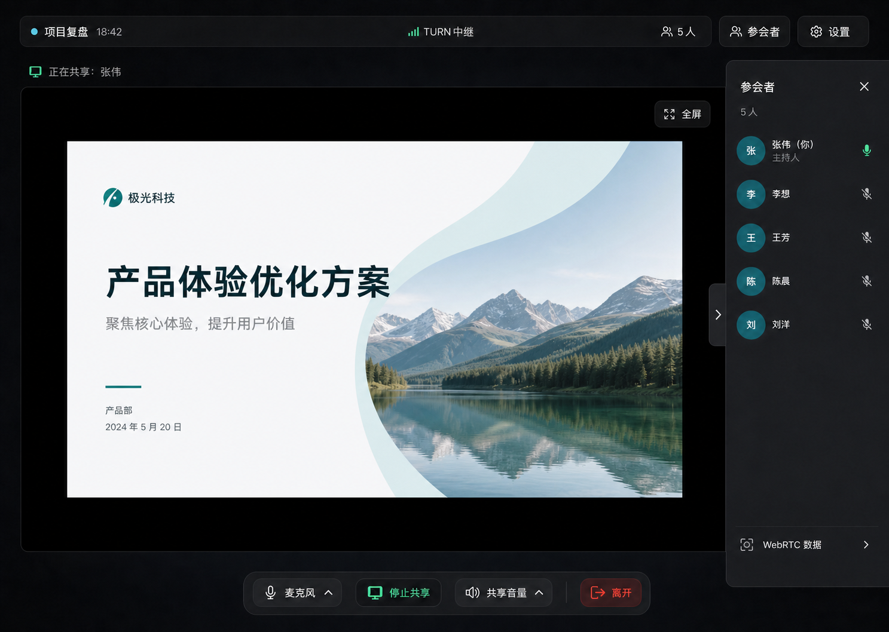
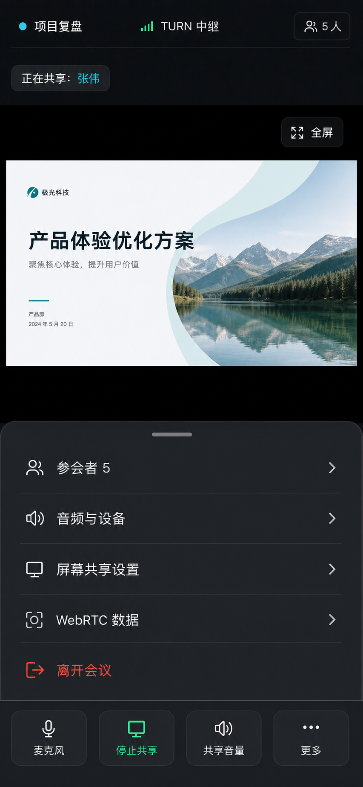

# 响应式会议工作台与失效链接跳转设计

日期：2026-08-24
状态：已确认

## 1. 背景

当前 Web 界面功能完整，但桌面端创建页和加入页将主要内容限制在单张居中卡片中，大面积显示区域没有参与信息组织；会议室的主控制、设备设置、屏幕共享参数、成员列表和主持人操作分散在多个固定区域，移动端只能把桌面结构继续向下堆叠。

另一个独立问题是：访问不存在、已结束或已过期的会议链接时，前端仍会渲染完整加入表单。后端已经能返回 `MEETING_NOT_FOUND`、`MEETING_EXPIRED`，并会在会议摘要中暴露 `ended` / `expired` 状态，但大厅页吞掉了摘要请求错误，也没有处理终态摘要。

## 2. 目标

- 在桌面端把共享舞台作为会议室的绝对主视觉，合理利用宽屏区域。
- 将高频会议控制与低频设置分层，减少固定菜单和长设置网格。
- 为移动端建立独立的信息层级：舞台优先、底部主控制、分层底部抽屉。
- 统一创建页、加入页和会议室的视觉语言，同时保留现有青绿色识别。
- 保留全屏观看和 WebRTC 数据功能；后者作为低频诊断入口。
- 所有共享画面保持源比例，不裁剪、不拉伸。
- 不存在、已结束、已过期的会议链接直接使用 `replace` 跳转到 `/create`。

## 3. 非目标

- 不新增摄像头、聊天、录制、反应、文件或数据看板。
- 不修改 LiveKit、P2P、TURN、屏幕共享发布或音频路由协议。
- 不修改会议生命周期的后端语义；后端现有摘要和错误码足以支持跳转。
- 不把 WebRTC 数据升级成常驻监控面板，也不新增统计上传。
- 不把生成的视觉稿作为运行时图片；最终界面仍由 React、CSS 和图标组件实现。

## 4. 已确认的视觉目标

### 4.1 桌面端



桌面端使用沉浸式深色画布、顶部轻量状态栏、占据主体的共享舞台、右侧按需抽屉和底部主控制坞。共享舞台右上角始终保留全屏按钮；WebRTC 数据位于抽屉底部的低频入口。

### 4.2 移动端



移动端保留同一视觉系统，但不压缩桌面侧栏。参会者、音频与设备、共享设置、WebRTC 数据和离开会议进入“更多”底部抽屉；麦克风、停止共享、共享音量和更多固定在底部主控制区。

## 5. 视觉系统

沿用现有会议室色板，并把它扩展到创建页和加入页：

- 画布：`#081419`
- 主表面：`#10242b`
- 抬升表面：`#17313a`
- 主文字：`#f3f8f9`
- 次文字：`#9cb2b8`
- 青绿强调：`#2fa9ba`
- 危险操作：`#d85c5c`
- 焦点环：`#f3c969`

创建页和加入页使用浅色任务表面嵌入同一深色应用外壳，不再使用孤立的大阴影居中卡片。会议室保持深色沉浸画布。标题、正文和控制统一采用现有系统字体栈，不再让创建/加入标题单独使用衬线字体。

新增 `lucide-react` 作为统一图标来源。图标只辅助语义；所有按钮仍有可见文本或无障碍名称，不手绘 SVG，也不用字符符号代替图标。

## 6. 页面与信息架构

### 6.1 全局应用外壳

- 桌面端顶部栏承载产品名称、当前任务标题和语言切换。
- 移动端顶部栏压缩为页面标题与语言入口，不额外占用大块空白。
- 语言切换不再游离在页面右上角，而是成为应用栏的一部分。
- 全局错误仍由现有错误边界处理。

### 6.2 创建会议页

桌面端采用最大宽度约 `1120px` 的两列布局：

- 左列：产品定位、短说明、当前会议状态和安全提示。
- 右列：创建会议表单与创建后的链接操作。
- 没有当前会议时，左列保持简洁说明，不制造空卡片。
- 创建结果在右列原位替换/扩展，不把用户带入新的视觉孤岛。

移动端改为单列：顶部说明压缩，表单直接使用页面表面；当前会议作为表单前的紧凑区块；主按钮保持 48px 以上高度。

### 6.3 加入大厅

桌面端采用两列布局：

- 左列：会议名称、昵称、密码和加入动作。
- 右列：设备检查、浏览器兼容提示和麦克风电平。
- 只有摘要验证为可加入状态后才显示表单。

移动端优先显示会议名称和加入表单；设备检查默认折叠为次级区域，展开后仍保留完整语义和焦点顺序。

### 6.4 会议室（桌面）

页面分为四层：

1. 顶部状态栏：会议名称、连接/传输状态、参会人数、参会者入口、设置入口。
2. 主舞台：共享画面、共享者标签、全屏按钮。
3. 按需右侧抽屉：参会者或设置；同一时间只打开一个。
4. 底部主控制坞：麦克风、开始/停止共享、共享音量、更多、离开。

高频动作不进入设置抽屉。编码、码率、画质、设备选择和接收端传输偏好归入设置抽屉。主持人管理动作在参会者抽屉的对应成员行中按需展开。

### 6.5 会议室（移动）

- 顶部栏显示会议名、传输状态和参会人数。
- 共享舞台占据可用宽度，控制区不覆盖关键画面。
- 底部固定四个高频控制：麦克风、共享、共享音量、更多。
- “更多”打开底部抽屉，包含参会者、音频与设备、屏幕共享设置、WebRTC 数据、离开会议。
- 每个次级入口打开嵌套底部抽屉，返回时恢复“更多”抽屉，而不是丢失会议上下文。
- 抽屉行和主控制触控目标不小于 44px；底部考虑安全区域。

## 7. 共享舞台比例、全屏与诊断

### 7.1 源比例

- `video` 始终使用 `object-fit: contain`。
- 在 `loadedmetadata`、`resize` 或切换实际媒体源后，读取 `videoWidth / videoHeight`。
- 非竖屏源（比例 `>= 1`）将该比例写入舞台 CSS 自定义属性，并在可用宽高内优先按原比例放大。
- 竖屏源同样不裁剪、不拉伸，但设置合理最大高度，避免挤出主控制。
- 源比例尚不可用时使用 `16 / 9` 作为占位，元数据到达后无动画切换到真实比例。
- P2P、TURN、LiveKit 交接期间继续使用已提交源的比例，待新源首帧/元数据准备后再更新，避免舞台跳动。

### 7.2 全屏

- 全屏按钮永久显示在舞台右上角，不放入“更多”。
- 保留现有 `requestFullscreen()` 行为和全屏状态 CSS。
- 全屏后隐藏页面级抽屉与控制，仅保留浏览器原生退出方式；退出全屏后恢复原布局。

### 7.3 WebRTC 数据

- 桌面端位于参会者/设置抽屉底部的“WebRTC 数据”行。
- 移动端位于“更多”底部抽屉中，打开后显示嵌套诊断抽屉。
- 复用现有 `WebRtcStatsPanel` 数据与采样逻辑，不改变指标含义。
- 无共享时入口可见但显示“暂无共享数据”，或者禁用并提供说明；不得静默消失造成用户误认为功能被删除。

## 8. 失效或终态会议链接状态机

大厅页不再使用 `summary === undefined` 同时表示加载、失败和无会议。改为显式状态：

```text
loading -> valid(summary) -> joined
        -> terminal -> /create (replace)
        -> unavailable -> retry UI
```

规则：

- 摘要返回 `created`、`active` 或 `grace`：进入 `valid`，渲染加入表单。
- 摘要返回 `ended` 或 `expired`：立即 `navigate('/create', { replace: true })`。
- 摘要请求返回 `MEETING_NOT_FOUND`、`MEETING_EXPIRED`、HTTP 404 或 410：立即 replace 到 `/create`。
- 加入请求返回相同终态错误：停止设备预览并 replace 到 `/create`。
- 网络错误、HTTP 429 或 5xx：不把服务故障误判成会议失效；显示清晰的加载失败与重试按钮。
- 验证完成前不渲染昵称、密码、设备检查或加入按钮，避免失效链接短暂显示可操作表单。
- 跳转使用 `replace`，浏览器后退不会再次回到失效链接。

后端 `getMeetingSummary` 保持现有行为；本次修复只调整前端对摘要状态和错误码的解释。

## 9. 组件边界

在保留现有媒体和会议控制器的前提下，按职责拆分 UI：

- `AppShell`：全局顶部栏、语言切换和页面容器。
- `TaskPageLayout`：创建页/加入页的桌面两列和移动单列布局。
- `MeetingTopBar`：会议名、连接路径、人数和抽屉入口。
- `MeetingControlDock`：高频控制，不承载高级设置。
- `MeetingDrawer`：桌面右侧抽屉与移动底部抽屉的共同语义接口。
- `MeetingMenu`：更多菜单及嵌套入口。
- `ScreenStage`：媒体源交接、真实比例、全屏，不承载菜单业务。
- `JoinLobbyPage`：大厅加载/有效/终态/不可用状态机。

现有 `MeetingRoomController`、`ScreenShareController`、P2P 控制器和 API 合同不因视觉重构而改变。

## 10. 无障碍与响应式要求

- 保留语义化 `main`、`header`、`nav`、`aside`、`dialog` 和表单标签。
- 抽屉具有标题、关闭按钮、焦点圈和可预测的焦点返回。
- 底部抽屉打开时限制背景交互，并支持 Escape 关闭（全屏状态除外）。
- 关键状态不只依靠颜色；连接路径、静音、共享者均有文本。
- 所有主操作和移动端抽屉行最小 44px，主按钮建议 48px。
- 320px 宽度不出现水平滚动；200% 缩放保持操作顺序。
- 尊重 `prefers-reduced-motion`；抽屉可使用短位移动画，减少动态时直接切换。
- 深色背景上的文字、按钮与焦点状态达到 WCAG AA 对比度目标。

## 11. 错误处理

- UI 抽屉和菜单状态不得影响媒体连接；渲染错误由现有错误边界接管。
- 设备/共享设置失败继续在当前上下文显示，不关闭抽屉或丢失用户选择。
- 全屏请求失败保持当前布局，不显示无响应按钮状态。
- WebRTC 数据读取失败只影响诊断抽屉，不中断会议。
- 大厅摘要加载失败提供重试；只有明确终态才跳转创建页。

## 12. 测试与验收

### 自动化

- 创建页和加入页在桌面/移动断点的结构、标题和操作顺序测试。
- 菜单/抽屉打开、关闭、互斥、焦点返回和 Escape 测试。
- 移动端主控制始终存在，离开会议位于更多抽屉。
- `ScreenStage` 对 16:9、16:10、4:3 和竖屏元数据保持真实比例，使用 `contain`。
- P2P/LiveKit 交接后更新到新源比例，全屏按钮和首帧保留逻辑不回归。
- WebRTC 数据入口在桌面和移动存在，并复用现有统计内容。
- 终态摘要、404/410 摘要错误、终态加入错误均 replace 到 `/create`。
- 429、5xx 和网络错误保留在大厅并显示重试，不错误跳转。
- 全量可访问性、类型、lint、单元、集成和 E2E 测试继续通过。

### 视觉 QA

- 桌面：1440×900、1920×1080。
- 平板：834×1194。
- 移动：390×844、320×568。
- 比较当前页面截图与最终实现，重点检查舞台面积、比例、菜单层级、文字裁切、触控目标和底部安全区。
- 使用真实 Chrome/Edge 验证全屏、共享比例、抽屉、键盘导航和 WebRTC 数据。

## 13. 发布

本次主要为 Web 前端变更。完成全量测试和真实浏览器验收后，沿用现有不可变 Web 制品与 Web-only override 流程，仅替换 Web 容器；API、Caddy、LiveKit、coturn 容器保持不变。失效链接跳转随同一 Web 版本发布。
